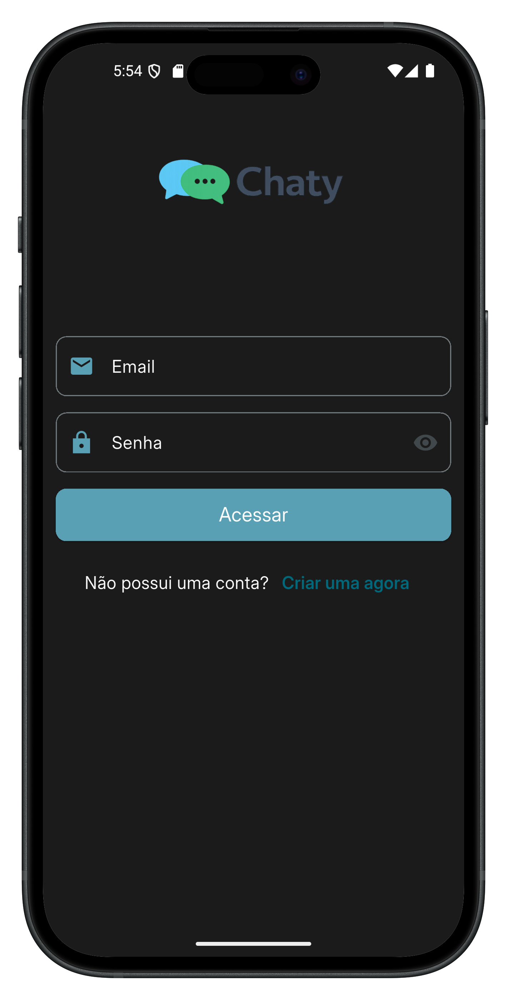
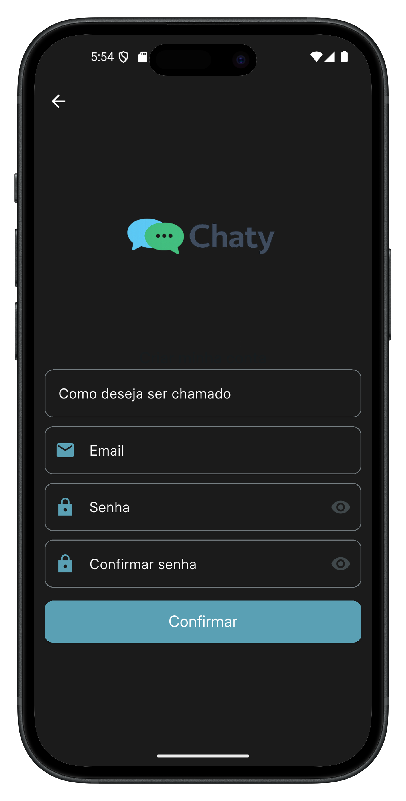
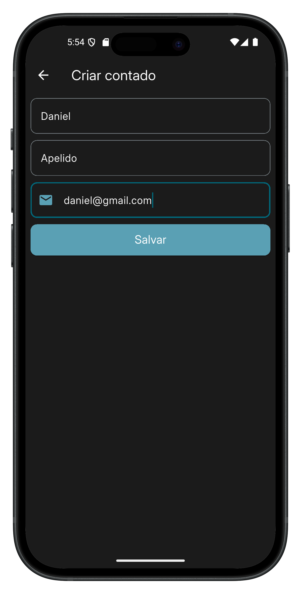
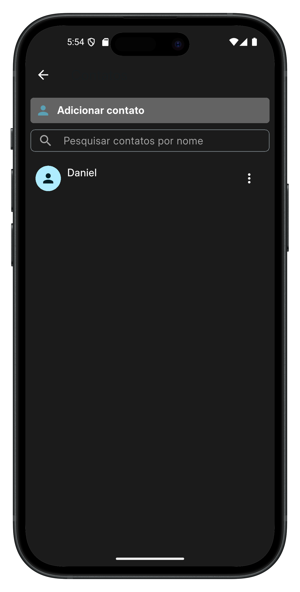
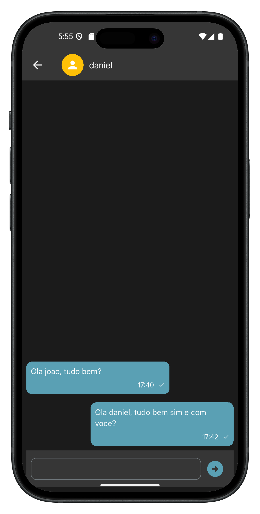

# Chaty

## Aplicativo de chat em tempo real desenvolvido com **Flutter** utilizando **Firebase**, com foco em **boas práticas de arquitetura**, escalabilidade e organização de código. Este projeto foi criado com fins de **estudo**, aplicando conceitos modernos como **Clean Architecture**, **BLoC/Cubit**, **Provider** e integração com **Firebase**.

<br>
<p align="center">
  
  
  
  
  
</p>


## Funcionalidades
- ✅ Autenticação com email e senha (Firebase Auth)
- ✅ Cadastro de contatos através do email
- ✅ Envio de mensagens em tempo real
- ✅ Inbox com lista de conversas
- ✅ Criação automática de conversa ao enviar mensagem
- ✅ Persistência de sessão

## Dependencias
<details>
     <summary> Ler mais </summary>

* [provider](https://pub.dev/packages/provider)
* [bloc](https://pub.dev/packages/bloc)
* [flutter_bloc](https://pub.dev/packages/flutter_bloc)
* [freezed_annotation](https://pub.dev/packages/freezed_annotation)
* [firebase_core](https://pub.dev/packages/firebase_core)
* [firebase_auth](https://pub.dev/packages/firebase_auth)
* [cloud_firestore](https://pub.dev/packages/cloud_firestore)
* [freezed](https://pub.dev/packages/freezed)
* [build_runner](https://pub.dev/packages/build_runner)

    </details>

## 🧠 Arquitetura utilizada

O projeto utiliza:

### Clean Architecture + Feature First

Estrutura organizada em camadas:

```
features/
├ presentation → UI, Cubits, Pages
├ domain → Entities, Usecases, Contracts
└ data → Repositories, Datasources, Models
```


## Como rodar o projeto

### 🔥 Configuração do Firebase

Necessário realizar a confirugação do Firebase no projeto, pra isso pode seguir essa documentação: https://firebase.google.com/docs/flutter/setup?hl=pt-br&platform=ios


### 1 - Clone o repositório
```
git clone https://github.com/seuusuario/chatty_app.git
```

### 2 - Instale as dependências
```
flutter pub get
```

### 3 - Execute o build_runner
```
dart run build_runner watch --delete-conflicting-outputs
```

### 5 - Execute o projeto

```
flutter run
```

## 🧪 Fluxo do app

1 - Usuário cria conta

2 - Usuário adiciona contato pelo email

3 - Usuário inicia conversa

4 - Usuário envia mensagens em tempo real

## 🎯 Objetivo do projeto

Este projeto foi criado para estudo de:

- Arquitetura limpa
- Firebase
- Chat em tempo real
- Boas práticas Flutter

## 📚 Aprendizados aplicados

- Separação de responsabilidades
- Código escalável
- Organização profissional
- Arquitetura enterprise


## Estrutura de pastas
<details>
     <summary> Clique para expandir </summary>

```
lib                                                                
├─ app                                                             
│  ├─ core                                                         
│  │  ├─ clients                                                   
│  │  │  ├─ auth                                                   
│  │  │  │  ├─ firebase                                            
│  │  │  │  │  └─ firebase_auth_client.dart                        
│  │  │  │  └─ auth_client.dart                                    
│  │  │  └─ cloud                                                  
│  │  │     ├─ firebase                                            
│  │  │     │  └─ firebase_firestore_client.dart                   
│  │  │     └─ cloud_client.dart                                   
│  │  ├─ di                                                        
│  │  │  └─ app_provider.dart                                      
│  │  ├─ domain                                                    
│  │  │  └─ value_objects                                          
│  │  │     └─ email.dart                                          
│  │  ├─ exceptions                                                
│  │  │  └─ exeptions.dart                                         
│  │  ├─ persistence                                               
│  │  │  └─ shared_preferences                                     
│  │  │     ├─ app_shared_preferences.dart                         
│  │  │     └─ shared_preferences_keys.dart                        
│  │  ├─ routes                                                    
│  │  │  └─ app_routes.dart                                        
│  │  └─ ui                                                        
│  │     ├─ styles                                                 
│  │     │  ├─ app_colors.dart                                     
│  │     │  └─ app_text_styles.dart                                
│  │     ├─ util                                                   
│  │     │  └─ date_time_formatter.dart                            
│  │     └─ widgets                                                
│  │        ├─ app_button.dart                                     
│  │        ├─ app_text_form_field.dart                            
│  │        ├─ confirm_dialog_widget.dart                          
│  │        ├─ loader.dart                                         
│  │        ├─ logo_app_widget.dart                                
│  │        ├─ messager.dart                                       
│  │        └─ search_text_form_field_widget.dart                  
│  ├─ features                                                     
│  │  ├─ auth                                                      
│  │  │  ├─ data                                                   
│  │  │  │  ├─ datasources                                         
│  │  │  │  │  ├─ local                                            
│  │  │  │  │  │  ├─ contract                                      
│  │  │  │  │  │  │  └─ auth_local_datasource.dart                 
│  │  │  │  │  │  └─ impl                                          
│  │  │  │  │  │     └─ auth_local_datasource_impl.dart            
│  │  │  │  │  └─ remote                                           
│  │  │  │  │     ├─ contract                                      
│  │  │  │  │     │  └─ auth_remote_datasource.dart                
│  │  │  │  │     └─ impl                                          
│  │  │  │  │        └─ auth_remote_datasource_impl.dart           
│  │  │  │  ├─ dtos                                                
│  │  │  │  │  ├─ login_user_account_dto.dart                      
│  │  │  │  │  ├─ signup_user_account_dto.dart                     
│  │  │  │  │  └─ signup_user_account_request_dto.dart             
│  │  │  │  ├─ models                                              
│  │  │  │  │  └─ logged_user_model.dart                           
│  │  │  │  └─ repositories                                        
│  │  │  │     └─ auth_repository_impl.dart                        
│  │  │  ├─ di                                                     
│  │  │  │  ├─ login_provider.dart                                 
│  │  │  │  └─ signup_provider.dart                                
│  │  │  ├─ domain                                                 
│  │  │  │  ├─ entities                                            
│  │  │  │  │  └─ user_account.dart                                
│  │  │  │  ├─ repositories                                        
│  │  │  │  │  └─ auth_repository.dart                             
│  │  │  │  └─ usecases                                            
│  │  │  │     ├─ contracts                                        
│  │  │  │     │  ├─ get_user_logged_usecase.dart                  
│  │  │  │     │  ├─ login_usecase.dart                            
│  │  │  │     │  └─ signup_usecase.dart                           
│  │  │  │     ├─ impl                                             
│  │  │  │     │  ├─ get_user_logged_usecase_impl.dart             
│  │  │  │     │  ├─ login_usecase_impl.dart                       
│  │  │  │     │  └─ signup_usecase_impl.dart                      
│  │  │  │     └─ params                                           
│  │  │  │        └─ signup_params.dart                            
│  │  │  └─ presentation                                           
│  │  │     ├─ login                                               
│  │  │     │  ├─ cubit                                            
│  │  │     │  │  ├─ login_cubit.dart                              
│  │  │     │  │  ├─ login_state.dart                              
│  │  │     │  │  └─ login_state.freezed.dart                      
│  │  │     │  ├─ page                                             
│  │  │     │  │  └─ login_page.dart                               
│  │  │     │  └─ widgets                                          
│  │  │     │     └─ signup_button.dart                            
│  │  │     ├─ shared                                              
│  │  │     │  └─ widgets                                          
│  │  │     │     ├─ email_text_form_field.dart                    
│  │  │     │     └─ password_text_form_field.dart                 
│  │  │     └─ signup                                              
│  │  │        ├─ cubit                                            
│  │  │        │  ├─ signup_cubit.dart                             
│  │  │        │  ├─ signup_state.dart                             
│  │  │        │  └─ signup_state.freezed.dart                     
│  │  │        └─ page                                             
│  │  │           └─ signup_page.dart                              
│  │  ├─ contact                                                   
│  │  │  ├─ data                                                   
│  │  │  │  ├─ datasources                                         
│  │  │  │  │  └─ remote                                           
│  │  │  │  │     ├─ contracts                                     
│  │  │  │  │     │  └─ contact_remote_datasource.dart             
│  │  │  │  │     └─ impl                                          
│  │  │  │  │        └─ contact_remote_datasource_impl.dart        
│  │  │  │  ├─ models                                              
│  │  │  │  │  └─ contact_document_model.dart                      
│  │  │  │  └─ repositories                                        
│  │  │  │     └─ contact_repository_impl.dart                     
│  │  │  ├─ di                                                     
│  │  │  │  ├─ contacts_provider.dart                              
│  │  │  │  └─ create_contact_provider.dart                        
│  │  │  ├─ domain                                                 
│  │  │  │  ├─ entities                                            
│  │  │  │  │  └─ contact.dart                                     
│  │  │  │  ├─ repositories                                        
│  │  │  │  │  └─ contact_repository.dart                          
│  │  │  │  └─ usecases                                            
│  │  │  │     ├─ contracts                                        
│  │  │  │     │  ├─ delete_contact_usecase.dart                   
│  │  │  │     │  ├─ get_contacts_usecase.dart                     
│  │  │  │     │  └─ upsert_contact_usecase.dart                   
│  │  │  │     ├─ impl                                             
│  │  │  │     │  ├─ delete_contact_usecase_impl.dart              
│  │  │  │     │  ├─ get_contacts_usecase_impl.dart                
│  │  │  │     │  └─ upsert_contact_usecase_impl.dart              
│  │  │  │     └─ params                                           
│  │  │  │        └─ save_contact_params.dart                      
│  │  │  └─ presentation                                           
│  │  │     ├─ list                                                
│  │  │     │  ├─ cubit                                            
│  │  │     │  │  ├─ contact_cubit.dart                            
│  │  │     │  │  ├─ contact_state.dart                            
│  │  │     │  │  └─ contact_state.freezed.dart                    
│  │  │     │  ├─ pages                                            
│  │  │     │  │  └─ contacts_page.dart                            
│  │  │     │  └─ widgets                                          
│  │  │     │     ├─ add_contact_button_widget.dart                
│  │  │     │     ├─ contact_item_list_widget.dart                 
│  │  │     │     └─ contact_list_widget.dart                      
│  │  │     └─ register                                            
│  │  │        ├─ cubit                                            
│  │  │        │  ├─ create_contact_cubit.dart                     
│  │  │        │  ├─ create_contact_state.dart                     
│  │  │        │  └─ create_contact_state.freezed.dart             
│  │  │        └─ page                                             
│  │  │           └─ create_contact_page.dart                      
│  │  ├─ messaging                                                 
│  │  │  ├─ data                                                   
│  │  │  │  ├─ datasources                                         
│  │  │  │  │  └─ remote                                           
│  │  │  │  │     ├─ contracts                                     
│  │  │  │  │     │  └─ messaging_remote_datasource.dart           
│  │  │  │  │     └─ impl                                          
│  │  │  │  │        └─ messaging_remote_datasource_impl.dart      
│  │  │  │  ├─ models                                              
│  │  │  │  │  ├─ conversation_document_model.dart                 
│  │  │  │  │  ├─ message_document_model.dart                      
│  │  │  │  │  ├─ user_conversation_document_model.dart            
│  │  │  │  │  └─ user_message_document_model.dart                 
│  │  │  │  └─ repositories                                        
│  │  │  │     └─ messaging_repository_impl.dart                   
│  │  │  ├─ di                                                     
│  │  │  │  ├─ chat_provider.dart                                  
│  │  │  │  └─ inbox_provider.dart                                 
│  │  │  ├─ domain                                                 
│  │  │  │  ├─ entities                                            
│  │  │  │  │  ├─ message.dart                                     
│  │  │  │  │  └─ user_conversation.dart                           
│  │  │  │  ├─ repositories                                        
│  │  │  │  │  └─ messaging_repository.dart                        
│  │  │  │  └─ usecases                                            
│  │  │  │     ├─ contracts                                        
│  │  │  │     │  ├─ delete_conversation_usecase.dart              
│  │  │  │     │  ├─ get_or_create_conversation_usecase.dart       
│  │  │  │     │  ├─ logout_usecase.dart                           
│  │  │  │     │  ├─ send_message_usecase.dart                     
│  │  │  │     │  ├─ watch_messages_usecase.dart                   
│  │  │  │     │  └─ watch_user_conversations_usecase.dart         
│  │  │  │     └─ impl                                             
│  │  │  │        ├─ delete_conversation_usecase_impl.dart         
│  │  │  │        ├─ get_or_create_conversation_usecase_impl.dart  
│  │  │  │        ├─ logout_usecase_impl.dart                      
│  │  │  │        ├─ send_message_usecase_impl.dart                
│  │  │  │        ├─ watch_messages_usecase_impl.dart              
│  │  │  │        └─ watch_user_conversations_usecase_impl.dart    
│  │  │  └─ presentation                                           
│  │  │     ├─ chat                                                
│  │  │     │  ├─ cubit                                            
│  │  │     │  │  ├─ chat_cubit.dart                               
│  │  │     │  │  ├─ chat_state.dart                               
│  │  │     │  │  └─ chat_state.freezed.dart                       
│  │  │     │  ├─ page                                             
│  │  │     │  │  └─ chat_page.dart                                
│  │  │     │  └─ widgets                                          
│  │  │     │     ├─ chat_list_widget.dart                         
│  │  │     │     ├─ input_message_widget.dart                     
│  │  │     │     └─ item_message_widget.dart                      
│  │  │     └─ inbox                                               
│  │  │        ├─ cubit                                            
│  │  │        │  ├─ inbox_cubit.dart                              
│  │  │        │  ├─ inbox_state.dart                              
│  │  │        │  └─ inbox_state.freezed.dart                      
│  │  │        ├─ pages                                            
│  │  │        │  └─ inbox_page.dart                               
│  │  │        └─ widgets                                          
│  │  │           ├─ inbox_button_app_bar_widget.dart              
│  │  │           ├─ inbox_drawer_widget.dart                      
│  │  │           ├─ inbox_item_list.dart                          
│  │  │           └─ inbox_list_widget.dart                        
│  │  ├─ splash                                                    
│  │  │  ├─ di                                                     
│  │  │  │  └─ splash_provider.dart                                
│  │  │  ├─ domain                                                 
│  │  │  │  └─ usecases                                            
│  │  │  │     └─ impl                                             
│  │  │  └─ presentation                                           
│  │  │     ├─ cubit                                               
│  │  │     │  ├─ splash_cubit.dart                                
│  │  │     │  ├─ splash_state.dart                                
│  │  │     │  └─ splash_state.freezed.dart                        
│  │  │     └─ page                                                
│  │  │        └─ splash_page.dart                                 
│  │  └─ user                                                      
│  │     ├─ data                                                   
│  │     │  ├─ datasources                                         
│  │     │  │  ├─ contracts                                        
│  │     │  │  │  └─ user_remote_datasource.dart                   
│  │     │  │  └─ impl                                             
│  │     │  │     └─ user_remote_datasource_impl.dart              
│  │     │  └─ repositories                                        
│  │     │     └─ user_repository_impl.dart                        
│  │     ├─ di                                                     
│  │     │  └─ user_provider.dart                                  
│  │     ├─ domain                                                 
│  │     │  ├─ repositories                                        
│  │     │  │  └─ user_repository.dart                             
│  │     │  └─ usecases                                            
│  │     │     ├─ contracts                                        
│  │     │     │  ├─ get_user_by_id_usecase.dart                   
│  │     │     │  └─ upsert_user_usecase.dart                      
│  │     │     ├─ impl                                             
│  │     │     │  ├─ get_user_by_id_usecase_impl.dart              
│  │     │     │  └─ upsert_user_usecase_impl.dart                 
│  │     │     └─ params                                           
│  │     │        └─ save_user_params.dart                         
│  │     ├─ models                                                 
│  │     │  └─ user_document_model.dart                            
│  │     └─ presentation                                           
│  │        ├─ cubit                                               
│  │        │  ├─ user_cubit.dart                                  
│  │        │  ├─ user_state.dart                                  
│  │        │  └─ user_state.freezed.dart                          
│  │        └─ page                                                
│  │           └─ user_page.dart                                   
│  └─ chatty_app.dart                                              
├─ firebase_options.dart                                           
└─ main.dart                                                       

```

</details>